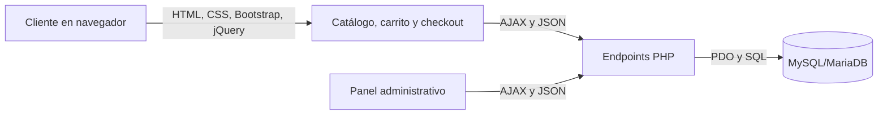

# Guía de exposición: Ecommerce Código Tinto

## 1. Presentación breve

**Código Tinto** es una tienda web de vinos, singanis y licores. El cliente puede registrarse, iniciar sesión, buscar productos, consultar stock, armar un carrito, indicar su ubicación y confirmar un pedido. El servidor valida la operación, la guarda en MySQL, descuenta el inventario y genera una factura. El personal administrativo gestiona productos, pedidos, usuarios e indicadores.

La aplicación separa responsabilidades en tres capas:

1. **Interfaz:** HTML, CSS, Bootstrap y jQuery/JavaScript.
2. **Servidor:** endpoints PHP que reciben solicitudes y aplican validaciones.
3. **Datos:** MySQL/MariaDB con PDO.



## 2. Estructura del proyecto

```text
CODIGO_TINTO/
|-- index.html                     Inicio
|-- pages/
|   |-- catalogo.html              Búsqueda y catálogo de productos
|   |-- producto-detalle.html      Detalle de un producto
|   |-- carrito.html               Carrito persistido en el navegador
|   |-- checkout-gps.html          Mapa, GPS, dirección, pago y confirmación
|   |-- factura.html                Vista de factura
|   |-- login.html                  Inicio de sesión
|   |-- registro.html               Registro de clientes
|   |-- mis-pedidos.html             Historial de pedidos
|   `-- admin/
|       |-- dashboard.html          Indicadores y alertas
|       |-- productos-crud.html     Alta, edición y baja de productos
|       |-- pedidos-envios.html     Seguimiento de pedidos y despacho
|       `-- usuarios.html           Gestión y soporte de cuentas
|-- assets/
|   |-- css/custom.css              Tema visual propio
|   |-- js/app.js                   Interacciones y conexión con la API
|   |-- js/compresor.js             Compresión de imágenes con Canvas
|   `-- img/                        Imágenes del sitio
|-- api/
|   |-- db.php                      Conexión PDO y cabeceras HTTP
|   |-- auth.php                    Registro, login, sesiones y acciones de usuarios
|   |-- productos.php               Consulta y mantenimiento de productos
|   |-- resenas.php                 Consulta y publicación de reseñas
|   `-- pedidos.php                 Pedidos, inventario, facturas y estados
`-- docs/
    |-- Modelo_BD.dbml              Modelo visual en formato DBML
    |-- Modelo_BD_DBML.txt           Modelo conceptual de la base de datos
    `-- codigo_tinto_db/             Archivos relacionados con el modelo/base
```

El archivo `api/db.php.txt` no está en la carpeta actual; el script de conexión es `api/db.php`.

## 3. Herramientas y para qué se usan

### HTML

HTML define la estructura y los controles de cada página: navegación, formularios, tablas, botones, campos numéricos y espacios que luego se completan dinámicamente. Los `id` y las clases, por ejemplo `#catalogo-grid` o `.item-cant`, permiten que JavaScript encuentre el elemento correcto.

Los formularios usan atributos nativos como `required`, `type="email"`, `type="number"` y `min`/`max` para dar una primera validación en el navegador. Esa validación mejora la experiencia, pero no reemplaza las validaciones PHP.

### CSS propio

`assets/css/custom.css` define los colores con variables CSS, el fondo oscuro, el tema tinto/dorado, las tarjetas de producto, tablas y paneles. Las clases de estado, por ejemplo `metric-ok`, `metric-warning` y `metric-danger`, cambian la presentación cuando JavaScript actualiza las métricas.

### Bootstrap 5

Bootstrap se carga desde CDN en las páginas. Se utiliza para:

- Diseño adaptable con `container`, `row`, `col-*` y `g-*`.
- Componentes y controles como `btn`, `badge`, `form-control`, `table`, `alert` y `modal`.
- Utilidades de espaciado, alineación, color y visibilidad como `mb-3`, `d-flex`, `text-warning` y `d-none`.

El proyecto personaliza Bootstrap con `custom.css`; Bootstrap aporta componentes y utilidades, mientras que los estilos propios dan identidad visual. El JavaScript de Bootstrap habilita componentes como el modal de soporte.

### jQuery 3.7.1

jQuery se carga desde CDN. En `app.js` se usa principalmente para:

- Seleccionar elementos: `$("#catalogo-grid")` o `$(".item-cant")`.
- Escuchar eventos: `.on("click", ...)`, `.on("change", ...)` y `.on("submit", ...)`.
- Cambiar contenido y atributos: `.text()`, `.html()`, `.val()`, `.attr()` y `.prop()`.
- Insertar resultados del servidor: `.append()` y `.empty()`.
- Cambiar estados visuales: `.addClass()` y `.removeClass()`.
- Enviar y recibir datos: `$.ajax()` con JSON.

Se usa delegación de eventos, como `$(document).on("click", ".btn-agregar-catalogo", ...)`, porque las tarjetas del catálogo se crean después de cargar la página.

### JavaScript del navegador

Además de jQuery, el proyecto utiliza JavaScript para la lógica y APIs web:

- `localStorage`: conserva el carrito al navegar o cerrar la pestaña.
- `sessionStorage`: conserva los datos de usuario para la sesión actual del navegador.
- `setTimeout`: restaura el botón después de mostrar una confirmación breve y elimina el estilo temporal de error.
- `Date`: calcula la edad durante el registro en el cliente.
- `URLSearchParams`: lee identificadores de producto o pedido de la URL.
- `navigator.geolocation`: solicita coordenadas GPS en el checkout.
- Leaflet y OpenStreetMap: muestran el mapa, el marcador rojo y permiten seleccionar la ubicación con clic o arrastre.
- `FileReader`, `Image` y `Canvas`: leen, redimensionan y comprimen la fotografía de un producto.
- `Map`, `Array.map`, `filter`, `find` y `reduce`: transforman productos, pedidos y totales.

### PHP, PDO y JSON

Los archivos de `api/` son endpoints: reciben solicitudes HTTP, validan los datos, ejecutan consultas SQL con PDO y responden JSON. PDO usa consultas preparadas para enviar los datos separados del SQL. `db.php` configura la conexión y las cabeceras comunes; no se deben copiar credenciales de conexión a documentos o presentaciones.

### MySQL/MariaDB

La base de datos mantiene los productos, cuentas, roles, pedidos, detalles, facturas, categorías, temporadas, métodos de pago y reseñas. La operación de compra usa una transacción para guardar el pedido y el detalle, descontar stock y emitir factura como una unidad: si un paso falla, se revierte la operación.

## 4. Organización de `app.js`

`assets/js/app.js` es el controlador común del navegador. Al iniciar, determina la ruta de la API, actualiza el contador del carrito, renderiza el carrito si la página lo contiene, verifica el usuario y configura las funciones que correspondan a los elementos presentes.

| Función | Responsabilidad |
|---|---|
| `cargarProductosDesdeBD(categoria, epoca, buscar)` | Consulta la API y dibuja tarjetas del catálogo. Actualiza también las métricas de productos disponibles y agotados. |
| `actualizarMetricasCatalogo(productos)` | Cuenta productos, disponibles y agotados; cambia las clases CSS de los paneles con `.removeClass()` y `.addClass()`. |
| `marcarCantidadInvalida($input)` | Aplica temporalmente `is-invalid` y `border-danger` al superar el stock, luego restaura el estilo. |
| `configurarFiltrosCatalogo()` | Lee búsqueda, categoría y temporada. Espera 300 ms después de escribir para no enviar una consulta por cada tecla. |
| `configurarSubidaProductoConCanvas()` | Configura la compresión de fotos, el formulario de alta/edición, el botón de editar y la baja lógica. |
| `cargarProductosAdmin()` | Vuelve a pedir productos al servidor y construye las filas y badges de stock del CRUD. |
| `obtenerCarrito()` | Lee el carrito JSON de `localStorage`. |
| `guardarCarrito(carrito)` | Guarda el carrito y recalcula el contador visible. |
| `sincronizarStockCarrito()` | Consulta el stock vigente antes de permitir continuar desde el carrito; ajusta cantidades y elimina productos agotados. |
| `agregarAlCarrito(...)` | Agrega un producto o suma unidades a uno existente, limitando la cantidad según el stock recibido. |
| `actualizarContadorCarrito()` | Suma las cantidades guardadas y actualiza el badge de navegación. |
| `cargarCarritoEnTabla()` | Dibuja los renglones, cantidades, subtotales y total del carrito. |
| `verificarEstadoSesion()` | Lee el usuario de `sessionStorage` y actualiza los accesos de navegación. |
| `configurarEstrellas()` | Actualiza visualmente una selección de estrellas donde está disponible el componente. |
| `determinarRutaApi()` | Calcula la ruta relativa correcta hacia `/api/` según la ubicación de la página. |
| `obtenerRutaRelativa(destino)` | Construye enlaces relativos que funcionan desde páginas raíz o subcarpetas. |

También hay manejadores de eventos en el mismo archivo para registro, login, logout, agregar al carrito, cambiar/eliminar cantidades, vaciar carrito y confirmar checkout.

## 5. Funciones principales del ecommerce

### Catálogo y stock

`catalogo.html` tiene filtros por texto, categoría y temporada. `cargarProductosDesdeBD()` llama a `GET api/productos.php`, recibe productos activos y construye las tarjetas con nombre, descripción, precio, imagen, valoración y stock.

El buscador también encuentra coincidencias en nombre, descripción, cepa, categoría y temporada, incluida Otoño. Los productos sin reseñas muestran estrellas vacías y el texto “Sin reseñas”. Cada tarjeta enlaza a `producto-detalle.html`, donde se conserva el control de stock y no se permite agregar productos agotados.

Si el stock es cero, la tarjeta muestra el badge **Agotado**, deshabilita el control de cantidad y el botón. Si el cliente intenta interactuar con el indicador de agotado, aparece un aviso. Si intenta superar el máximo, se limita la cantidad y se muestra una alerta junto con el estado visual temporal del campo.

### Carrito

El carrito se mantiene en `localStorage` con datos como identificador, nombre, precio, cantidad, imagen y stock. El usuario puede modificar cantidades o quitar productos; cada cambio vuelve a dibujar el subtotal y total. Al abrir `carrito.html`, `sincronizarStockCarrito()` contrasta las cantidades guardadas con el stock actual que devuelve la API.

**Importante:** `localStorage` es solo una comodidad del navegador; no es la fuente de verdad. El servidor vuelve a validar el stock y consulta el precio real de cada producto al confirmar el pedido, ignorando precios manipulados desde el navegador.

### Registro e inicio de sesión

El registro valida campos, correo, CI, longitud de contraseña y mayoría de edad. PHP vuelve a validar los datos y guarda la contraseña con `password_hash()`. En el login, PHP compara la contraseña con `password_verify()` y devuelve el usuario sin la contraseña. El navegador guarda el resultado en `sessionStorage` y presenta accesos adecuados al rol.

Además, al iniciar sesión `auth.php` crea una sesión PHP en el servidor con el identificador de la cuenta. Esta sesión se utiliza para autorizar la compra; `sessionStorage` solo mantiene el estado visual del navegador y no es la fuente de autenticación del servidor.

### Checkout y GPS

En `checkout-gps.html`, el cliente selecciona el punto de entrega en un mapa Leaflet con datos de OpenStreetMap. Puede mover el alfiler rojo, pulsar otra ubicación o solicitar la ubicación del navegador. También proporciona una referencia de entrega y datos fiscales, y selecciona el método de pago. Las coordenadas se reflejan en los campos de latitud y longitud; si no se concede permiso GPS, se conservan coordenadas predeterminadas de Tarija.

El acceso directo al checkout se redirige al login si no existe una sesión de navegador. Al enviar el formulario, JavaScript manda a `POST api/pedidos.php` el método de pago, ubicación, dirección, total y productos del carrito. El servidor obtiene la cuenta desde la sesión PHP y no confía en el `cuenta_id` enviado por el navegador.

### Pedido, factura y movimiento de inventario

En `pedidos.php`, PHP valida cada producto, cantidad, estado activo y total. Después, dentro de una transacción:

1. Inserta el pedido.
2. Inserta cada detalle.
3. Consulta el precio vigente en la base de datos y calcula cada subtotal con ese valor.
4. Descuenta el inventario con una actualización condicionada:

```sql
UPDATE productos
SET stock = stock - ?
WHERE id_producto = ? AND stock >= ?
```

5. Comprueba que se pudo descontar stock.
6. Inserta la factura con CI/NIT y razón social.
7. Confirma todo con `commit`.

Si no hay suficiente stock o algún paso falla, se ejecuta `rollBack()` y se responde con estado de error. Así no queda guardado un pedido a medias ni se permite que el stock quede negativo.

La factura muestra cada producto, cantidad, precio unitario y subtotal. Si un administrador cancela un pedido, la factura asociada cambia a estado `ANULADO`.

### Pedidos y logística

`mis-pedidos.html` solicita los pedidos de la cuenta actual y permite consultar estado, fecha, destino y factura. En el panel administrativo, `pedidos-envios.html` filtra órdenes, presenta coordenadas con enlaces a Google Maps y permite actualizar el estado. `pedidos.php` acepta `PUT` para cambiarlo y sincroniza la factura como `ANULADO` cuando el estado pasa a `Cancelado`.

### Reseñas

`resenas.php` lista los productos de los pedidos de la cuenta autenticada. Solo permite reseñar productos de pedidos entregados y comprueba la relación entre cuenta, pedido y producto. La restricción única de la base de datos impide publicar más de una reseña para el mismo producto dentro del mismo pedido. El promedio y la cantidad de reseñas se reflejan después en el catálogo mediante la consulta de productos.

### Administración

- **Dashboard:** `cargarMetricasDashboard()` consulta pedidos y productos para presentar ventas facturadas, pedidos activos, entregas e inventario bajo. Al volver a la pestaña se actualiza de nuevo.
- **Productos:** `cargarProductosAdmin()` llena la tabla con el stock actual; permite registrar, editar y dar de baja lógicamente productos. Al guardar una edición usa `PUT`; para nuevos usa `POST`. Al editar, la fotografía anterior se conserva si no se carga una nueva.
- **Usuarios:** `cargarUsuarios()` clasifica cuentas por rol. El personal puede cambiar el estado permitido, consultar historial de pedidos/reseñas y generar una contraseña temporal desde la herramienta de soporte.
- **Envíos:** `cargarTablaEnvios(estado)` consulta pedidos y redibuja la tabla según el filtro.

## 6. Endpoints disponibles

| Archivo y método | Uso |
|---|---|
| `auth.php?accion=registro` — `POST` | Crear una cuenta después de validar los datos. |
| `auth.php?accion=login` — `POST` | Verificar credenciales, crear la sesión PHP y devolver datos del usuario y su rol. |
| `auth.php?accion=logout` — `POST` | Destruir la sesión PHP y cerrar la sesión del navegador. |
| `auth.php?accion=listar_usuarios` — `GET` | Obtener las cuentas para administración. |
| `auth.php?accion=cambiar_estado_usuario` — `POST` | Activar o dar de baja una cuenta con validación de jerarquía. |
| `auth.php?accion=historial_soporte&cuenta_id=...` — `GET` | Consultar pedidos y reseñas de soporte para una cuenta. |
| `auth.php?accion=reset_password_soporte` — `POST` | Generar una contraseña temporal y guardar su hash. |
| `productos.php` — `GET` | Listar productos activos; acepta filtros de categoría, época y búsqueda. |
| `productos.php` — `POST` | Registrar un producto nuevo; requiere rol Admin o SEO. |
| `productos.php?id=...` — `PUT` | Actualizar un producto existente; conserva la imagen si no llega una nueva y requiere rol Admin o SEO. |
| `productos.php?id=...` — `DELETE` | Dar de baja lógicamente un producto; requiere rol Admin o SEO. |
| `pedidos.php` — `POST` | Validar, registrar y facturar una compra usando precios y stock reales del servidor. |
| `pedidos.php` — `GET` | Listar pedidos propios o, con rol administrativo, todos; acepta filtro por estado. |
| `pedidos.php` — `PUT` | Cambiar el estado de un pedido; requiere rol Admin o SEO. |
| `resenas.php` — `GET` | Listar pedidos y productos reseñables de la cuenta autenticada. |
| `resenas.php` — `POST` | Publicar una reseña de 1 a 5 estrellas para un producto de un pedido entregado. |

Las respuestas de la API usan JSON, por ejemplo `{ "status": "ok", "data": [...] }` o `{ "status": "error", "mensaje": "..." }`.

## 7. Modelo de datos explicado

- **roles:** permisos y nombre de cada perfil, como Cliente, Admin y SEO.
- **cuentas:** usuario, correo, CI, contraseña cifrada, datos de contacto, estado activo y rol.
- **categorias** y **temporadas:** opciones para clasificar productos.
- **productos:** precio, stock, imagen, descripción, categoría, temporada y estado activo.
- **metodospago:** opciones disponibles para pagar.
- **pedidos:** cliente, ubicación, dirección, tiempo estimado, estado y total.
- **detallepedidos:** productos y cantidades que componen cada pedido.
- **facturas:** datos fiscales, número de factura, estado y monto asociado al pedido.
- **resenas:** puntuaciones y comentarios asociados a productos, clientes y pedidos.

Relaciones principales: una cuenta tiene un rol; un producto pertenece a una categoría y temporada; una cuenta puede crear muchos pedidos; el detalle enlaza pedidos con productos; cada factura se asocia a un pedido.

## 8. Guion de demostración de dos minutos

1. **Inicio (15 s):** mostrar el catálogo y explicar que las tarjetas y los indicadores se cargan desde PHP/MySQL.
2. **Selección (20 s):** buscar un producto, revisar el stock y agregar una cantidad válida al carrito.
3. **Carrito (15 s):** mostrar subtotal, total y el límite de cantidad; señalar que los datos persisten en el navegador, pero el stock se vuelve a consultar al entrar.
4. **Checkout (20 s):** iniciar sesión, mover el alfiler rojo en el mapa o capturar GPS, confirmar la dirección y elegir método de pago.
5. **Compra (25 s):** confirmar el pedido. Explicar que PHP vuelve a comprobar el stock dentro de una transacción y lo descuenta al insertar el detalle.
6. **Resultado (25 s):** mostrar el número de pedido/factura y abrir el Dashboard o Catálogo Admin. Al volver a la pestaña o refrescar, se consulta la API y se ve el nuevo stock.

Ejemplo para narrar: **“Si antes había 12 botellas y el cliente compra 3, después de confirmar el pedido el servidor guarda 9. Si otra compra intenta llevarse más unidades de las disponibles, la API rechaza el pedido y revierte la transacción.”**

## 9. Preparación y notas para exponer

- La página debe ejecutarse desde un servidor PHP, por ejemplo XAMPP, y tener acceso a MySQL/MariaDB. Abrir solo el HTML como archivo local no ejecuta los endpoints PHP.
- jQuery, Bootstrap CSS y el bundle JavaScript se descargan desde CDN; la demostración necesita conexión a internet para esos recursos.
- La geolocalización depende del permiso del navegador y normalmente requiere HTTPS o `localhost`; si no está disponible se usan coordenadas predeterminadas.
- `sessionStorage` solo conserva datos de interfaz. La compra se autoriza mediante la sesión PHP creada por `auth.php`; `pedidos.php` rechaza solicitudes sin sesión y comprueba que la cuenta siga activa.
- El botón del carrito y el acceso directo a `checkout-gps.html` redirigen al login cuando no hay sesión de navegador. Esta protección de interfaz complementa, pero no reemplaza, la validación del servidor.
- Leaflet, OpenStreetMap, Bootstrap y jQuery se cargan desde CDN; la demostración del mapa necesita conexión a internet.
- Las acciones administrativas y de inventario se validan también en PHP por rol; ocultar botones en el navegador no se considera una autorización.
- En producción conviene guardar las credenciales de `api/db.php` en variables de entorno o en la configuración privada del hosting, y rotarlas si el archivo fue compartido públicamente.
- `producto-detalle.html` usa un manejador propio, pero ahora envía el stock disponible al carrito y deshabilita la compra cuando el producto está agotado.
- `assets/img/productos/default.svg` se usa como imagen de respaldo cuando un producto no tiene imagen.
- La conexión vive en `api/db.php`. No se deben incluir contraseñas ni usuarios de base de datos en esta guía, capturas públicas o repositorios accesibles.

## 10. Frase de cierre

**“La interfaz facilita la compra, pero la decisión final siempre la toma el servidor: consulta el stock real, valida el pedido, descuenta inventario dentro de una transacción y recién entonces confirma la factura.”**
